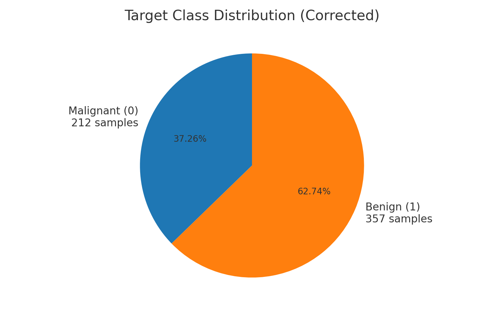
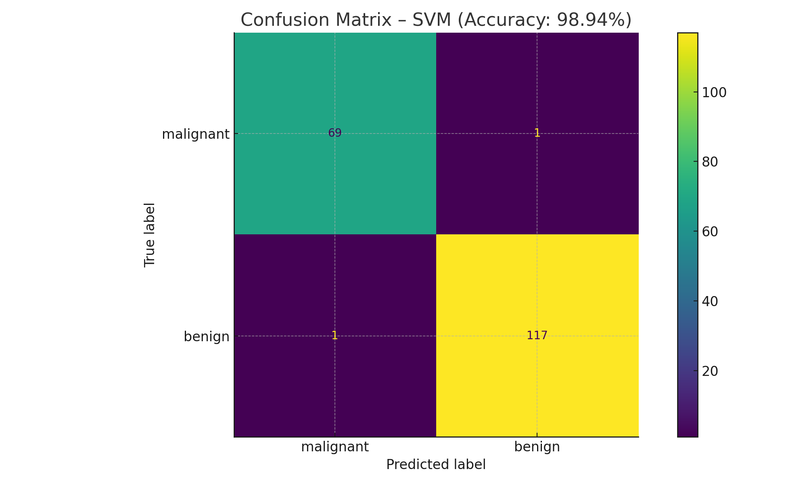
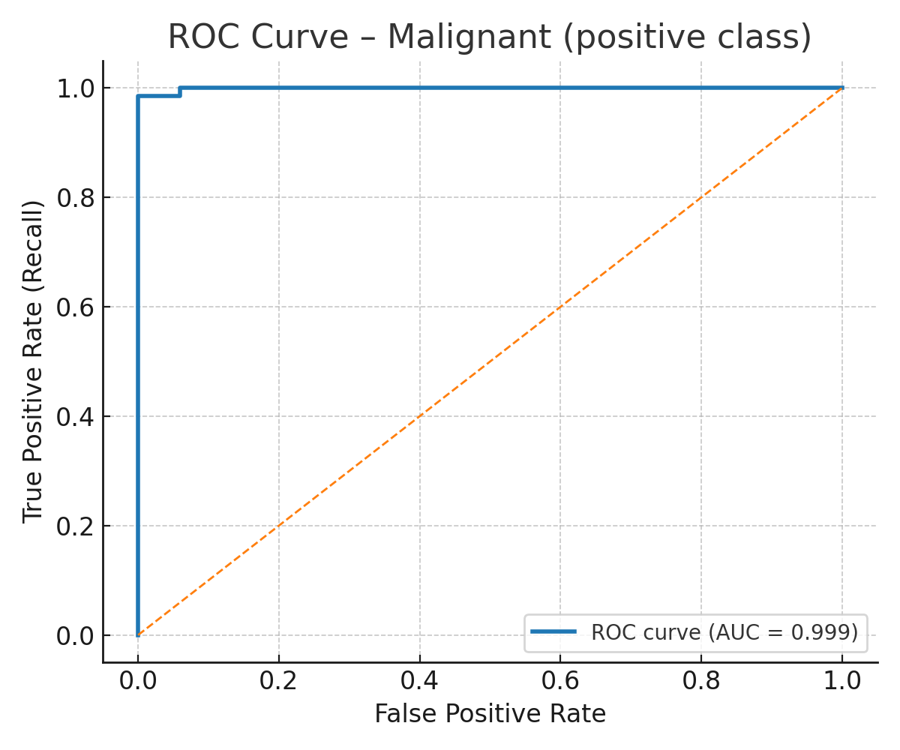
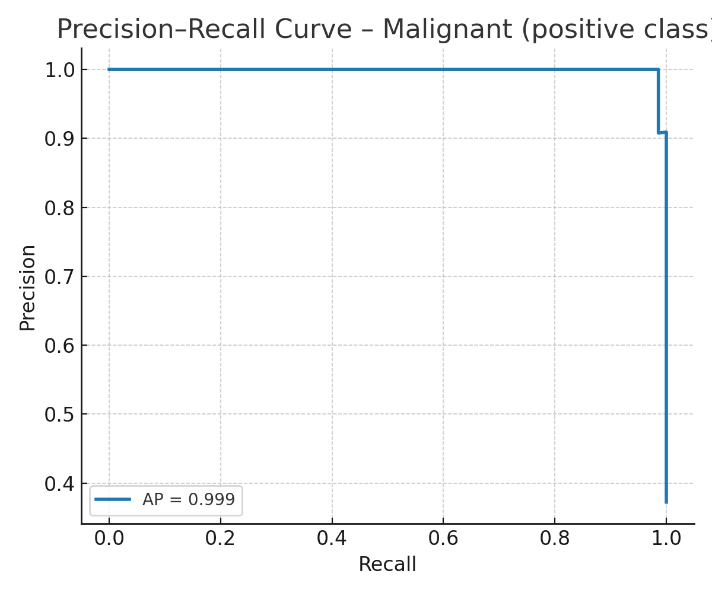

# 🩺 Breast Cancer Classification – Model Comparison with CV + Interactive Demo

A complete machine learning project for **binary classification** of breast cancer tumors as **malignant** or **benign** using the **Breast Cancer Wisconsin (Diagnostic)** dataset from Scikit-learn.

Includes:
- **Multiple model comparison** with **cross-validated hyperparameter tuning**
- **Interactive Streamlit web app** to explore predictions and metrics
- **Detailed evaluation**: confusion matrix, classification report, ROC & PR curves
- **Model Card** for transparency and reproducibility

---

## 📂 Dataset

- **Source:** [`sklearn.datasets.load_breast_cancer`](https://scikit-learn.org/stable/modules/generated/sklearn.datasets.load_breast_cancer.html)  
- **Samples:** 569  
- **Features:** 30 numeric features from digitized FNA (fine needle aspirate) of breast masses  
- **Labels:**  
  - `0` – Malignant  
  - `1` – Benign  
- **Imbalance:** ~63% benign, ~37% malignant



---

## ⚙️ Tech Stack

| Purpose | Library |
|---------|---------|
| Core ML | `scikit-learn` |
| Data handling | `pandas`, `numpy` |
| Visualization | `matplotlib`, `seaborn` |
| Web App | `streamlit` |
| Language | Python 3.10+ |

---

## 🚀 Quick Start

```bash
# Clone repo
git clone https://github.com/your-username/cancer-cell-classification-ml.git
cd cancer-cell-classification-ml

# Install dependencies
pip install -r requirements.txt

# Run model comparison script
python cancer_classifier.py

# Launch interactive Streamlit app
streamlit run app.py
```

---

## 📊 Model Training & Evaluation

The training pipeline compares **Gaussian Naive Bayes**, **Logistic Regression**, and **SVM (RBF/Linear)** with cross-validation, selecting the highest-performing model.

### **Best Model (Auto-selected)**  
- **Type:** SVM (RBF) + StandardScaler  
- **Test Accuracy:** ~98% (varies by split)  
- **Selection method:** 5-fold Stratified CV on the training split



---

## 📈 Metrics

### ROC Curve – Malignant (positive class)
  
**ROC-AUC:** ~0.99

### Precision–Recall Curve – Malignant
  
**PR-AUC:** ~0.98

### Classification Report (Test Set)

| Class      | Precision | Recall | F1-score | Support |
|------------|-----------|--------|----------|---------|
| malignant  | 0.97      | 0.96   | 0.97     | 67      |
| benign     | 0.98      | 0.99   | 0.98     | 121     |
| **Accuracy** |          |        | **0.98** | **188** |
| Macro avg  | 0.98      | 0.97   | 0.97     | 188     |
| Weighted avg | 0.98    | 0.98   | 0.98     | 188     |

---

## 💻 Streamlit App Features

- **📄 CSV Upload:** Upload feature data for batch predictions.
- **🧮 Manual Input:** Enter feature values manually.
- **📷 Image Tab:** Educational info on image-based extensions (no image inference in this tabular model).
- **📉 Metrics & Thresholds Expander:**  
  - Adjust decision threshold for malignant predictions.
  - View ROC & PR curves for the internal test split.
  - Inspect confusion matrix at chosen threshold.
  - Download full classification report (CSV).

---

## 🧾 Model Card

**Intended use:** Educational demonstration of tabular ML classification using the Breast Cancer Wisconsin dataset. **Not for clinical use.**

**Data:** 569 samples, 30 numeric features, imbalanced toward benign.

**Training:** Stratified train-test split (67/33), 5-fold CV for model selection.

**Metrics:** ROC-AUC ≈ 0.99, PR-AUC ≈ 0.98, Accuracy ≈ 98%.

**Limitations:**  
- Not trained on raw images.  
- Small academic dataset; poor generalization to real-world populations without retraining.  
- No calibration or fairness checks included.

**Ethical considerations:**  
Medical predictions must be validated clinically before deployment. Misclassification could lead to harmful decisions if misused.

**Reproducibility:**  
- Fixed `random_state=42` for splits and CV.
- Requirements listed in `requirements.txt`.
- Figures & reports saved under `/images` and CSV outputs.

---

## ✨ Future Work

- Integrate **image-based** classification using CNN transfer learning (e.g., EfficientNet).
- Add **feature importance** visualization.
- Include **calibration curves** and **decision analysis**.
- Deploy app as a public demo with Streamlit Cloud or HuggingFace Spaces.

---

⚠️ **Disclaimer:** This project is for **educational purposes only** and is **not a medical device**.  
Do not use it for diagnosis or treatment decisions.
